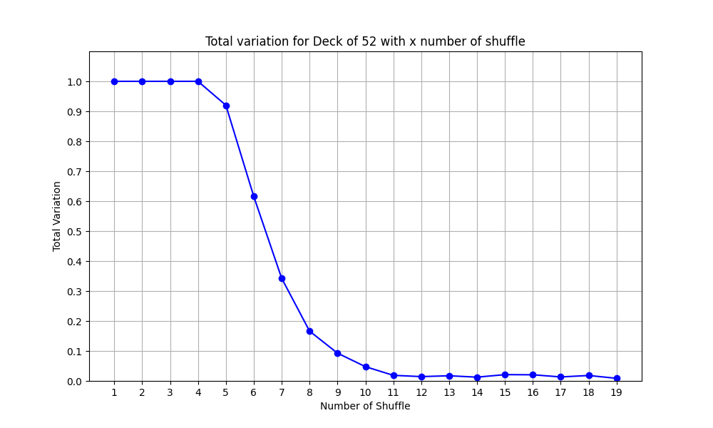

# Shuffling
Gilbert-Shannon-Reeds model for shuffling.


## Installing

To install the dependencies, run:

```bash
pip install -r requirements.txt
```
---

## Run
Use --help to see riffle.py Usage.

```bash
  usage: riffle.py [-h] [--deck_size DECK_SIZE] [--my_seed MY_SEED]

optional arguments:
  -h, --help            show this help message and exit
  --deck_size DECK_SIZE Add Deck size example 52
  --my_seed MY_SEED     Add seed value example 0
```

Riffle shuffle.

Example:
```bash
  python3 riffle.py --deck_size 52 my_seed 10
```


Use --help to see GRSAlgo Usage.

```bash
usage: GRSAlgo.py [-h] [--deck_size DECK_SIZE]

optional arguments:
  -h, --help            show this help message and exit
  --deck_size DECK_SIZE Add Deck size

```
Gilbert–Shannon–Reeds model.

Example:
```bash
  python3 GRSAlgo.py --deck_size 52
```
Use --help to see Python3 OptimalNumberofshuffle.py Usage

```bash
usage: OptimalNumberofshuffle.py [-h]
                                 [--deck_size_list DECK_SIZE_LIST [DECK_SIZE_LIST ...]]
                                 [--samples SAMPLES] [--plot] [--low LOW]
                                 [--high HIGH]

optional arguments:
  -h, --help            show this help message and exit
  --deck_size_list DECK_SIZE_LIST [DECK_SIZE_LIST ...] Add Deck size
  --samples SAMPLES     Add sample size
  --plot                Add plot
  --low LOW             Add low no of shuffle
  --high HIGH           Add max number of shuffle

```

Finding variation distance after k number of shuffle

Example:
```bash
 python3 OptimalNumberofshuffle.py --deck_size_list 26 52 104 --samples 10000 --low 1 --high 20
```
---

## Test 
test for riffle.py and GRSAlgo shuffling
```bash
   python3 test_riffle.py
```
---

## Plots

variation distance plot for deck size 26,56,104

[[deck size 26](https://github.com/adityaknegi/Shuffling/blob/master/img/26.png)]
</a>
[[deck size 52](https://github.com/adityaknegi/Shuffling/blob/master/img/52.png)]
</a>
[[deck size 104](https://github.com/adityaknegi/Shuffling/blob/master/img/104.png)]
</a>
---

## 
Total variation for 26 52 and 104 falls below 0.5 is After 5,7,8
1. After 5 shuffle deck with 26  is randomized.
2. After 7 shuffle deck with 52 is randomized.
3. After 8 shuffle deck with 104  is randomized.

Do you think these findings are robust to small changes to the shuffling
model? Why or why not? If you’re having trouble thinking of changes to the model, 
consider how one might model wear and tear on the cards, for instance, if they became sticky from years of fun times and spilled drinks. 

Shuffling changes can make randomization slow.  For instance, We randomly drop multiple cards(example 5 set)  from the bottom of one of the sub-decks onto our shuffled pile.  These sets of cards can only be separated by the split, so more number of shuffles are required.  
the real-life case scenario is using an old deck with few sticky cards(cards behave like a set of cards so low probability for detachment, 
so we need to shuffle more time).
