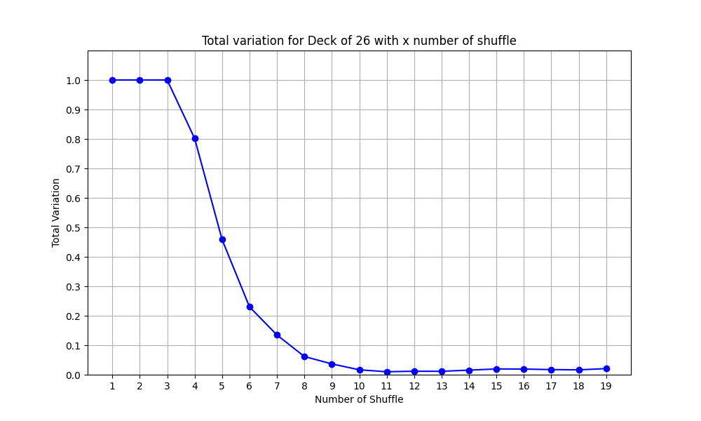
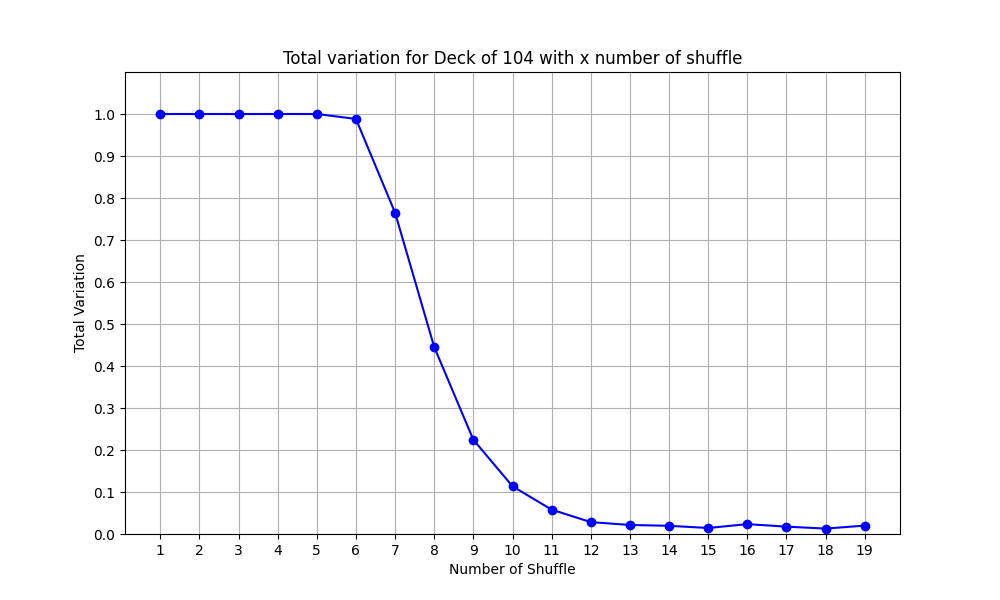

# Shuffling
Gilbert-Shannon-Reeds model for shuffling.


## Installing

To install the dependencies, run:

```bash
pip install -r requirements.txt
```
---

## Run
Use --help to see riffle.py Usage

```bash
  usage: riffle.py [-h] [--deck_size DECK_SIZE] [--my_seed MY_SEED]

optional arguments:
  -h, --help            show this help message and exit
  --deck_size DECK_SIZE Add Deck size example 52
  --my_seed MY_SEED     Add seed value example 0
```
Example:
```bash
  python3 riffle.py --deck_size 52 my_seed 10
```


Use --help to see GRSAlgo Usage
```bash
usage: GRSAlgo.py [-h] [--deck_size DECK_SIZE]

optional arguments:
  -h, --help            show this help message and exit
  --deck_size DECK_SIZE Add Deck size

```
Example:
```bash
  python3 GRSAlgo.py --deck_size 52
```
Use --help to see Python3 OptimalNumberofshuffle.py Usage
```bash
usage: OptimalNumberofshuffle.py [-h]
                                 [--deck_size_list DECK_SIZE_LIST [DECK_SIZE_LIST ...]]
                                 [--samples SAMPLES] [--plot] [--low LOW]
                                 [--high HIGH]

optional arguments:
  -h, --help            show this help message and exit
  --deck_size_list DECK_SIZE_LIST [DECK_SIZE_LIST ...] Add Deck size
  --samples SAMPLES     Add sample size
  --plot                Add plot
  --low LOW             Add low no of shuffle
  --high HIGH           Add max number of shuffle

```
Example:
```bash
 python3 OptimalNumberofshuffle.py --deck_size_list 26 52 104 --samples 10000 --low 1 --high 20
```
---

## Test 
test for riffle.py and GRSAlgo shuffling
```bash
   python3 test_riffle.py
```
---

## Plots

variation distance plot for deck size 26,56,104

[[deck size 26](https://github.com/adityaknegi/Shuffling/blob/master/img/26.png)]
</a>
[[deck size 52](https://github.com/adityaknegi/Shuffling/blob/master/img/52.png)]
</a>
[[deck size 104](https://github.com/adityaknegi/Shuffling/blob/master/img/104.png)]
</a>
